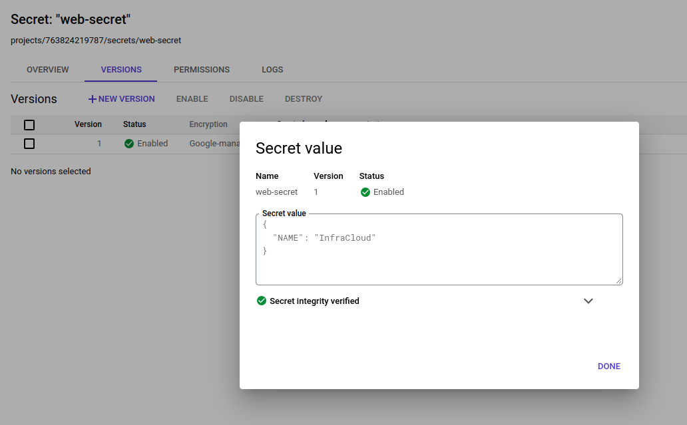
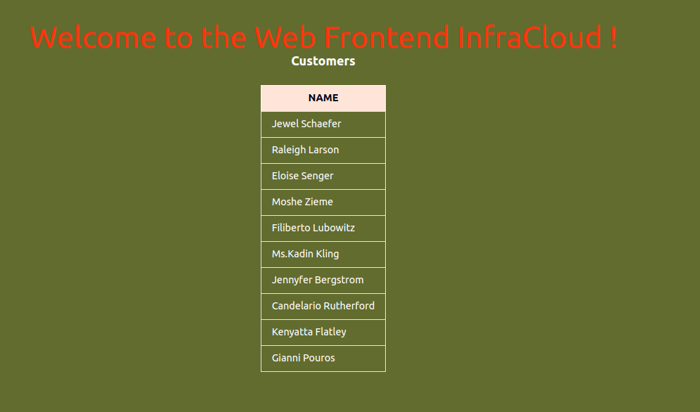
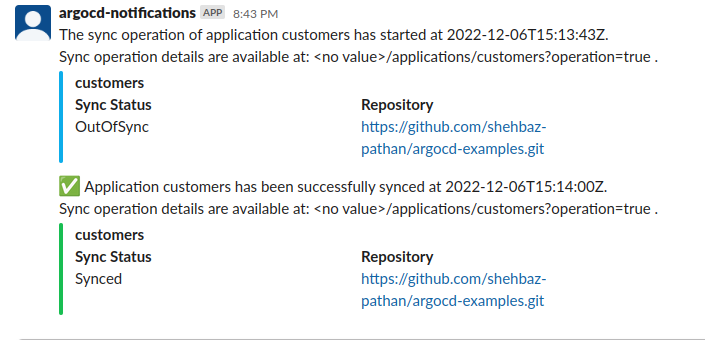

# Argocd-module

This module will walk you through the concepts of GitOps and Argocd(Gitops tools) with hands-on to gear up and start using Argocd deployment in your projects.

Total number of days: 1.5 days

# Level-01

# Table of Contents
- [01-Introduction to GitOps]()
    - [Gitops Principle]()
    - [Gitops tools]()
    - [Benefits and Drawback]()
- [02-ArgoCD]()
    - [ArgoCD Architecture]()
    - [ArgoCD server Installation and CLI]() 
- [03-Adding git repos through UI, CLI and declarative way in argocd]()
- [04-Understanding Multi Cluster Setup ]()
- [05-Understanding HA Cluster Setup]()
- [06-ArgoCD with Helm](#06-argocd-with-helm)
- [07-ArgoCD with Kustomize]()
- [08-Understanding App of Apps]()
- [09-Understanding Application sets]()
- [10-Assignment on AppicationSets]()
- [11-Using Bitnami sealed secrets for storing secrets on git repos securely]()
- [12-ArgoCD integration With External Secrets Operator](#12-argocd-integration-with-external-secrets-operator)
- [13-ArgoCD with HC Vault and Bitnami sealed secrets]()
- [14-end-to-end CI/CD pipeline using Jenkins(CI) and ArgoCD(CD)]()

# Level-02
- [01-User Management](#01-user-management60-minutes)
    - [Local Users/Accounts](#a-local-usersaccounts20-minutes)
    - [SSO](#b-sso40-minutes)
- [02-ArgoCD with github actions for end-to-end CI/CD ]()
- [03-ArgCD Sync Phases, Waves and Sync Windows](#03-argcd-sync-phases-waves-and-sync-windows)
    - [Sync Phases and Waves](#a-sync-phases-and-waves) 
    - [Sync Windows](#b-sync-windows)
- [04-ArgoCD Diffing customizations and Notifications](#04-argocd-diffing-customizations-and-notifications)
   - [Diffing Customization](#a-diffing-customization) 
   - [Notifications](#b-notifications)
- [05-ArgoCD Disaster Recovery.]()
- [06-ArgoCD with ArgoRollouts for progressive delivery]()

# ArgoCD Level-01
## 06-Argocd with Helm
We can install helm charts using ArgoCD.
- [Read][Helm with ArgoCD](https://argo-cd.readthedocs.io/en/stable/user-guide/helm/)

##### Assignment
:computer: Deploy [this](https://github.com/shehbaz-pathan/simple-microservices-app/tree/helm-repo/customer-info) sample app helm chart using ArgoCD, use below details
```
helm repo: 	https://shehbaz-pathan.github.io/simple-microservices-app/chart
chart version: 0.1.0
```
set the iamge of customers deployment to ```gcr.io/tetratelabs/customers:2.0.0``` in ArgoCD application to use different image than the default image from helm chart

<details>
<summary>Answer</summary></br>

for this assignment application manifest would look like

```yaml
apiVersion: argoproj.io/v1alpha1
kind: Application
metadata:
  name: customers
  namespace: argocd
spec:
  project: default
  source:
    chart: customer-info
    repoURL: https://shehbaz-pathan.github.io/simple-microservices-app/chart/
    targetRevision: 0.1.0
    helm:
      releaseName: customers
      parameters:
        - name: customers.image
          value: gcr.io/tetratelabs/customers:2.0.0
  destination:
    server: "https://kubernetes.default.svc"
    namespace: default
  syncPolicy:
    automated:
      prune: true
      selfHeal: true
    syncOptions:
      - CreateNamespace=true
```
</details>

## 12-ArgoCD Integration With External Secrets Operator
Secrets are the intgral part of modern day applications, secrets are used to store the store the sensitive data such as passwords, keys, APIs, tokens, and certificates, storing secrets on any vcs repository is not a good prctice. We can use external secrets operator with ArgoCD to store secrets required by application on any external secret managers like AWS Secret Manager, Google Secret Manager, HC Vault etc and pull them into the application without writing them down in any kubernetes manifests.

- [Read][External Secrets Operator](https://external-secrets.io/v0.7.0-rc1/introduction/getting-started/)

##### Assigment
 Use this sample k8s application [repo](https://github.com/shehbaz-pathan/simple-microservices-app/tree/master/manifests/external-secrets-example) and deploy this application using ArgoCD, this app reads value for environment variable NAME from secret, store the value of this env variable in external secrets manager(AWS or Google) and pull that value using External Secrets Operator, integrate External Secrets Operator with ArgoCD.
 <details>
<summary>Answer</summary></br>
In this solution we will use Google Secret Manager for storing secret

- Follow [this](https://external-secrets.io/v0.7.0-rc1/provider/google-secrets-manager/) guide to use Google Secret Manager with External Secrets Operator
Create SecretStore and ExternalSecret manifets and push them to the repo to deploy them using ArgoCD
- Create secret store to connect with Google Secret Manger

```yaml
apiVersion: external-secrets.io/v1beta1
kind: SecretStore
metadata:
  name: gcp-secret-store
spec:
  provider:
      gcpsm:                                  
        auth:
          secretRef:
            secretAccessKeySecretRef:
              name: gcpsm-secret              
              key: secret-access-credentials  
        projectID: your-project-id
```
- Create external secret resource to pull secret value from GCP secrets

```yaml
apiVersion: external-secrets.io/v1alpha1
kind: ExternalSecret
metadata:
  name: example
spec:
  refreshInterval: 10m
  secretStoreRef:
    kind: SecretStore
    name: gcp-secret-store              
  target:
    name: web-secret
    creationPolicy: Owner
  dataFrom:
    - key: web-secret
```
- Create the application 
```yaml
apiVersion: argoproj.io/v1alpha1
kind: Application
metadata:
  name: customers
  namespace: argocd    
spec:
  project: default
  source:
    repoURL: 'https://github.com/shehbaz-pathan/simple-microservices-app.git'
    path: manifests/external-secrets-example/
    targetRevision: HEAD
  destination:
    server: 'https://kubernetes.default.svc'
    namespace: default
```

Google Secret:


Expected Result:


</details>


# ArgoCD Level-02
## 01-User Management(60 Minutes)
### a) Local Users/Accounts(20 Minutes)
ArgoCD allows us to create to local users/accounts for authenticating and authorizing the different users and groups and restrict access to the ArgoCD and its resources. Argo CD does not have its own user management system and has only one built-in user admin. The admin user is a superuser and it has unrestricted access to the system. ArgoCD allows restrict access to ArgoCD resources using RBAC permissions.
- [Read][Local Users/Accounts](https://argo-cd.readthedocs.io/en/stable/operator-manual/user-management/#local-usersaccounts-v15)
- [Read][RBAC Rules](https://argo-cd.readthedocs.io/en/stable/operator-manual/rbac/#rbac-configuration)

##### Assignment(10 Minutes)
:computer: Create a new user for Argocd and give the permissions to get, create, update and delete appplications in default AppProject
<details>
<summary>Answer</summary></br>
argocd-cm:

```yaml
apiVersion: v1
kind: ConfigMap
metadata:
  labels:
    app.kubernetes.io/name: argocd-cm
    app.kubernetes.io/part-of: argocd
  name: argocd-cm
  namespace: argocd
data:
  accounts.Newuser: apiKey,login
  ```
argocd-rbac-cm:

```yaml
apiVersion: v1
kind: ConfigMap
metadata:
  labels:
    app.kubernetes.io/name: argocd-rbac-cm
    app.kubernetes.io/part-of: argocd
  name: argocd-rbac-cm
  namespace: argocd
data:
  policy.csv: |-
    p,role:defaul-applications-CRUD-role,applications,get,default/*,allow
    p,role:defaul-applications-CRUD-role,applications,create,default/*,allow
    p,role:defaul-applications-CRUD-role,applications,update,default/*,allow
    p,role:defaul-applications-CRUD-role,applications,get,default/*,allow
    g,NewUser,role:defaul-applications-CRUD-role
```
</details>

### b) SSO(40 Minutes)
ArgoCD allows us to integrate SSO to use our existing identity provider to access ArgoCD resources, since we already know ArgoCD don't its own user management system but allow us to restrict access to its resource using RBAC permissions so we can use our existing identity provider for authenticating and RBAC permission for authorization.
- [Read][ArgoCD SSO Configuration](https://argo-cd.readthedocs.io/en/stable/operator-manual/user-management/#sso)
##### Assignment(20 Minutes)
:computer: Configure ArgoCD SSO using Okta via SAML method
<details>
<summary>Answer</summary></br>

Follow [this](https://argo-cd.readthedocs.io/en/stable/operator-manual/user-management/okta/#saml-with-dex) guide for ArgoCD SSO integration using Okta
</details>

## 03-ArgCD Sync Phases, Waves and Sync Windows
## a) Sync Phases and Waves
Argo CD executes a sync operation in a number of steps. At a high-level, there are three phases pre-sync, sync and post-sync.

Within each phase you can have one or more waves, that allows you to ensure certain resources are healthy before subsequent resources are synced.
- [Read][ArgoCD Phases and Syncs](https://argo-cd.readthedocs.io/en/stable/user-guide/sync-waves/#how-do-i-configure-phases)
- [Read][Phase Configuration](https://argo-cd.readthedocs.io/en/stable/user-guide/sync-waves/#how-do-i-configure-phases)
- [Read][Wave Configuration](https://argo-cd.readthedocs.io/en/stable/user-guide/sync-waves/#how-do-i-configure-waves)

##### Assignment
:computer: This is sample k8s application [repo](https://github.com/shehbaz-pathan/simple-microservices-app/tree/master/manifests) deploy this application using ArgoCD and create post-sync hooks to verify we are getting http status code 200 from both ```web-frontend``` and ```customers``` service.
Note: use sync waves to run hook for customers service before the web-frontend service
<details>
<summary>Answer</summary></br>
create a post-sync hook for customers service

```yaml
apiVersion: batch/v1
kind: Job
metadata:
   name: customers-status
   annotations:
    argocd.argoproj.io/hook: PostSync
    argocd.argoproj.io/sync-wave: "1"
    argocd.argoproj.io/hook-delete-policy: BeforeHookCreation
spec:
   backoffLimit: 3
   template:
     spec:
       restartPolicy: OnFailure
       containers:
          - name: customers-status-checker
            image: curlimages/curl
            command: ["/bin/sh","-c","[[ $(curl http://customers/ -s -o /dev/null -w \"%{http_code}\") -eq 200 ]] && exit 0 || exit 1"]
```
create post-sync hook for web-frontend service
```yaml
apiVersion: batch/v1
kind: Job
metadata:
   name: web-front-status
   annotations:
    argocd.argoproj.io/hook: PostSync
    argocd.argoproj.io/sync-wave: "2"
    argocd.argoproj.io/hook-delete-policy: BeforeHookCreation
spec:
   backoffLimit: 3
   template:
     spec:
       restartPolicy: OnFailure
       containers:
          - name: customers-status-checker
            image: curlimages/curl
            command: ["/bin/sh","-c","[[ $(curl http://web-frontend/ -s -o /dev/null -w \"%{http_code}\") -eq 200 ]] && exit 0 || exit 1"]
```
as mentioned above we used sync wave 1 for customers service and wave 2 for web-frontend in this order hook for customers service will get executed before web-frontend
</details>

## b) Sync Windows
Sync windows are configurable windows of time where syncs will either be blocked or allowed. Using sync windows we can allow or block app snyc for the specific duration of either specific applications, namespaces or entire cluster, sync windows will be helpful for restricting the deployment of applications on specific time lets say deploying production apps during weekend only no app deployments during working hours etc.
- [Read][Sync Windows](https://argo-cd.readthedocs.io/en/stable/user-guide/sync_windows/)

##### Assignmetn 
:computer: Create an allow sync window in default AppProject for entire cluster with duration of 2h between 8PM-10PM on all days also create a deny window as well of same duration and timing.
<details>
<summary>Answer</summary></br>

- Update the default AppProject with the sync windows mentioned above
```sh
kubectl edit appproject default -n argocd
```

```yaml
apiVersion: argoproj.io/v1alpha1
kind: AppProject
metadata:
  name: default
  namespace: argocd
spec:
  clusterResourceWhitelist:
  - group: '*'
    kind: '*'
  destinations:
  - namespace: '*'
    server: '*'
  sourceRepos:
  - '*'
  syncWindows:
   - kind: allow
    schedule: '0 20 * * *'
    duration: 2h
    clusters:
    - in-cluster
  - kind: deny
    schedule: '0 20 * * *'
    duration: 2h
    clusters:
    - in-cluster
```
</details>

##### Quick Questions

1. After creating above mentioned sync windows would you be able to sync any app between 8PM-10PM every day?
<details>
<summary>Answer</summary></br>

> NO, because an active deny window will orverrides the an active allow window for you would not be able sync any application during that window
</details>

2. After creating above mentioned sync windows would you be able to sync any app at any time expect 8PM-10PM?
<details>
<summary>Answer</summary></br>

> No, because there would no active allow window at any time expect 8PM-10PM, but we have an active deny window during the same time 8PM-10PM that means we would not be able to sync any application at any time.```
</details>

## 04-ArgoCD Diffing Customizations and Notifications
### a) Diffing Customization
The diffing customization feature allows users to configure how ArgoCD behaves during the diff stage which is the step that verifies if an Application is synced or not. Argo CD allows you to optionally ignore differences of problematic resources. The diffing customization can be configured for single or multiple application resources or at a system level.
- [Read][Diffing Customization](https://argo-cd.readthedocs.io/en/stable/user-guide/diffing/)
- [Read][Application Level Configuration](https://argo-cd.readthedocs.io/en/stable/user-guide/diffing/#application-level-configuration)
- [Read][System Level Confgiguration](https://argo-cd.readthedocs.io/en/stable/user-guide/diffing/#system-level-configuration)

##### Assignmetn 
:computer: Use this sample k8s application [repo](https://github.com/shehbaz-pathan/simple-microservices-app/tree/master/manifests) and deploy this application using ArgoCD and later configure the diffing customization to ingoner the count of replicas for web-frontend deployment.
<details>
<summary>Answer</summary></br>

- Deploy the application using ArgoCD
- Set the replica count of web-frontend deployment to 2 by editing the web-frontend deployment manually, now check the sync status of the app it will show OutOfSync due to replica count changed for web-frontend deployment.
- Update the application with diffing configuration

```yaml
apiVersion: argoproj.io/v1alpha1
kind: Application
metadata:
  name: customers-details
  namespace: default
spec:
      ignoreDifferences:
       - group: apps
         kind: Deployment
         namespace: default
         name: web-frontend
         jqPathExpressions:
          - .spec.replicas
      project: default
      source:
        repoURL: https://github.com/shehbaz-pathan/simple-microservices-app.git
        targetRevision: HEAD
        path: manifests
      destination:
        server: https://kubernetes.default.svc
        namespace: default
      syncPolicy:
        syncOptions:
         - RespectIgnoreDifferences=true
        automated:
          prune: true
```
- Now change the replica count of web-frontend deployment to 2 and and check this time application sync status would not show OutOfSync because we are ignoring changes of web-frontend deployment for replica count
</details>

## b) Notifications
Argo CD Notifications continuously monitors Argo CD applications and provides a flexible way to notify users about important changes in the application state. Using a flexible mechanism of triggers and templates you can configure when the notification should be sent as well as notification content
- [Read][Notifications](https://argo-cd.readthedocs.io/en/stable/operator-manual/notifications/)

##### Assignment
:computer: Use this sample k8s application [repo](https://github.com/shehbaz-pathan/simple-microservices-app/tree/master/manifests) and deploy this application using ArgoCD with notification configuration to sent notification on slack whenever sync is running, sync succeeded and sync failed for this app.

<details>
<summary>Answer</summary></br>

- Follow [this](https://argo-cd.readthedocs.io/en/stable/operator-manual/notifications/services/slack/) guide to setup slack write bot and notification channel
- Deploy the ArgoCD app manifest will look like this with notification configuration
```yaml
apiVersion: argoproj.io/v1alpha1
kind: Application
metadata:
  name: customers
  namespace: default
  annotations:
     notifications.argoproj.io/subscriptions: |
     - trigger: [on-sync-failed, on-sync-running, on-sync-succeeded]
        destinations:
          - service: slack
            recipients: [argocd-notifications-test]        
spec:
  project: default
  source:
    repoURL: 'https://github.com/shehbaz-pathan/argocd-examples.git'
    path: customer-details
    targetRevision: HEAD
  destination:
    server: 'https://kubernetes.default.svc'
    namespace: default
  syncPolicy:
    syncOptions:
     - RespectIgnoreDifferences=true
  ignoreDifferences:
    - group: apps
      kind: Deployment
      name: web-frontend
      namespace: default
      jqPathExpressions:
        - .spec.replicas
```
once you first deploy above app after required slack related config you should get notifications like below while sync is running and when sync is succeeded

</details>
