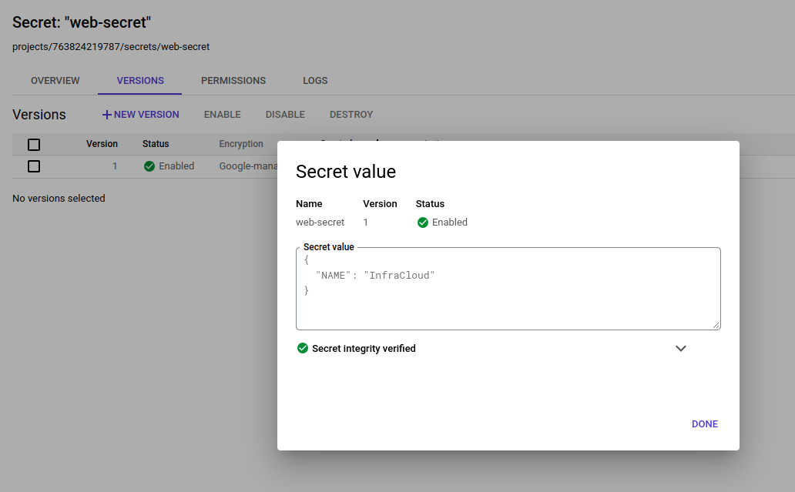
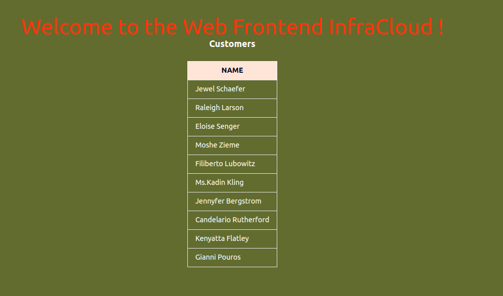
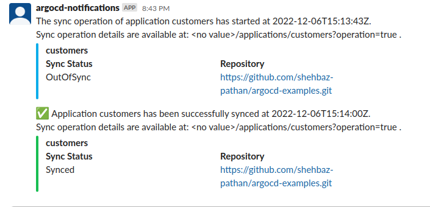

# Argocd-module

This module will walk you through the concepts of GitOps and Argocd(Gitops tools) with hands-on to gear up and start using Argocd deployment in your projects.

Total number of days: 1.5 days

# Level-01

# Table of Contents
- [01-Introduction to GitOps]()
    - [Gitops Principle]()
    - [Gitops tools]()
    - [Benefits and Drawback]()
- [02-ArgoCD]()
    - [ArgoCD Architecture]()
    - [ArgoCD server Installation and CLI]() 
- [03-Adding git repos through UI, CLI and declarative way in argocd]()
- [04-Understanding Multi Cluster Setup ]()
- [05-Understanding HA Cluster Setup]()
- [06-ArgoCD with Helm](#06-argocd-with-helm)
- [07-ArgoCD with Kustomize](#07-argocd-with-kustomize-60-minutes)
- [08-Understanding App of Apps](#08-understanding-app-of-apps-20-minutes)
- [09-Understanding Application sets](#09-applicationset)
- [10-Assignment on AppicationSets](#10-assignment)
- [11-Using Bitnami sealed secrets for storing secrets on git repos securely](#11-using-bitnami-sealed-secrets-for-storing-secrets-on-git-repos-securely)
- [12-ArgoCD integration With External Secrets Operator](#12-argocd-integration-with-external-secrets-operator)
- [13-ArgoCD with HC Vault and Bitnami sealed secrets]()
- [14-end-to-end CI/CD pipeline using Jenkins(CI) and ArgoCD(CD)]()

# Level-02
- [01-User Management](#01-user-management)
    - [Local Users/Accounts](#a-local-usersaccounts)
    - [SSO](#b-sso)
- [02-ArgoCD with github actions for end-to-end CI/CD](#02-argocd-with-github-actions-for-end-to-end-cicd)
- [03-ArgCD Sync Phases, Waves and Sync Windows](#03-argcd-sync-phases-waves-and-sync-windows)
    - [Sync Phases and Waves](#a-sync-phases-and-waves) 
    - [Sync Windows](#b-sync-windows)
- [04-ArgoCD Diffing customizations and Notifications](#04-argocd-diffing-customizations-and-notifications)
   - [Diffing Customization](#a-diffing-customization) 
   - [Notifications](#b-notifications)
- [05-ArgoCD Disaster Recovery.](#05-argocd-disaster-recovery-40-minutes)
- [06-ArgoCD with ArgoRollouts for progressive delivery]()

# ArgoCD Level-01
## 06-Argocd with Helm
We can install helm charts using ArgoCD.
- [Read][Helm with ArgoCD](https://argo-cd.readthedocs.io/en/stable/user-guide/helm/)

##### Assignment
:computer: Deploy [this](https://github.com/shehbaz-pathan/simple-microservices-app/tree/helm-repo/customer-info) sample app helm chart using ArgoCD, use below details
```
Helm repo: 	https://shehbaz-pathan.github.io/simple-microservices-app/chart
Chart name: customer-info
Chart version: 0.1.0
```
set the image of customers deployment to ```gcr.io/tetratelabs/customers:2.0.0``` in ArgoCD application to use different image than the default image from helm chart

<details>
<summary>Answer</summary></br>

for this assignment application manifest would look like

```yaml
apiVersion: argoproj.io/v1alpha1
kind: Application
metadata:
  name: customers
  namespace: argocd
spec:
  project: default
  source:
    chart: customer-info
    repoURL: https://shehbaz-pathan.github.io/simple-microservices-app/chart/
    targetRevision: 0.1.0
    helm:
      releaseName: customers
      parameters:
        - name: customers.image
          value: gcr.io/tetratelabs/customers:2.0.0
  destination:
    server: "https://kubernetes.default.svc"
    namespace: default
  syncPolicy:
    automated:
      prune: true
      selfHeal: true
    syncOptions:
      - CreateNamespace=true
```
</details>

## 07-Argocd with Kustomize (60 minutes)

Kustomize traverses a Kubernetes manifest to add, remove or update configuration options without forking. It is available both as a standalone binary and as a native feature of kubectl (and by extension oc)
- [Read][Kustomize](https://kubectl.docs.kubernetes.io/guides/introduction/kustomize/)
- [Read][kustomize-argocd](https://argo-cd.readthedocs.io/en/latest/user-guide/kustomize/)

##### Kustomized Application:</br>

Argo CD has native support for Kustomize. You can use this to avoid duplicating YAML for each deployment. This is especially good to use if you have different environments or clusters you’re deploying to.


##### Hands-on activity (30 minutes)</br>
:computer: This is sample k8s application [repo](https://github.com/shehbaz-pathan/simple-microservices-app/tree/master/manifests) we have integrate with kustomize template with 2 enviornment and deploy the application to argocd with env changes as:
```
Test : replica count for customer-2 and web-frontend-3, nameSuffix-test, commonLabels: purpose-Argocd-demo , env-test
Prod : replica count for customer-3 and web-frontend-4 , nameprifix-prod, commonLabels: purpose-Argocd-demo , env-prod
```
<details>
<summary>Answer</summary></br>
 Pre-Requsite:
 
1 kustomization installed 

2 use concept of an "overlay", where you have a "base" set of manifests and you overlay your kustomizations for test and stage enviornment.

Step1: Make 2 directory base with apllication manifest and kustomization.yaml for base application to pick up the k8 manifest as:
dir: base/kustomization.yaml

```yaml
kind: Kustomization
resources:
  - web-frontend.yaml
  - customers.yaml 
commonLabels:
  purpose: Argocd-demo
 
  ```

Step2: For test enviornment kustomization template with required enviornment dir overlays/test/kustomization.yaml

```yaml
apiVersion: kustomize.config.k8s.io/v1beta1
kind: Kustomization

bases:
  - ../../base

commonLabels:
  purpose: Argocd-demo
  env : test

nameSuffix: -test

replicas:
  - name: web-frontend
    count: 2
  - name: customers-v2
    count: 3

  ```

Test the test enviornment is working properly by kustomization build and apply to cluster command: `kustomize build | kubectl apply -f -` from directory 
`/overlays/test/kustomization` with required configuration

Step 3 : For Prod enviornment kustomization template with required enviornment dir overlays/prod/kustomization.yaml

```yaml
apiVersion: kustomize.config.k8s.io/v1beta1
kind: Kustomization

bases:
  - ../../base

commonLabels:
  env : prod

nameSuffix: -test

replicas:
  - name: web-frontend
    count: 3
  - name: customers-v2
    count: 4
  ```

Test the prod enviornmenttemplate is working properly by kustomization build and apply to cluster command: `kustomize build | kubectl apply -f -` from directory `/overlays/prod/kustomization.yaml` with required configuration 

</details>

## 08-Understanding App of Apps (20 minutes)

Argo CDs App-of-Apps pattern enables us to programmatically and automatically generate Argo CD applications.We can create a route Argo CD application using the App-of-Apps pattern.The route Argo CD application points to a folder that includes the Argo CD application YAML definition files for each microservers or application.The application YAMLs for each microservers refers to a directory holding
the application manifests.The idea here is to create a single Argo CD application and upload all of its definition files to a Git repository path.
- [Read][App of Apps](https://argo-cd.readthedocs.io/en/stable/operator-manual/declarative-setup/#app-of-apps)

##### Hands-on activity (30 minutes)</br>
:computer: Create argocd application deployment for Test and Prod application using the yaml files created in Topic-07 create an application with Env-apps pointing to test and Prod application yaml with namespace test for test application and prod for prod application.

<details>
<summary>Answer</summary></br>
We will create declarative Jobs for apps of apps for env.yaml and env-apps folder containing test and prod jobs.

env.yaml
```yaml
apiVersion: argoproj.io/v1alpha1
kind: Application
metadata:
  name: k8s-env-apps
  namespace: argocd
spec:
  project: default
  source:
    repoURL: (git repo where yaml are places)
    targetRevision: HEAD
    path: .(path)/env-apps/(test,Prod)yaml
  destination:
    server: https://kubernetes.default.svc
    namespace: argocd
  syncPolicy:
    automated:
      prune: true
      selfHeal: true
```
env-apps/test.yaml
```yaml
apiVersion: argoproj.io/v1alpha1
kind: Application
metadata:
  name: test-app
  namespace: argocd
  finalizers:
    - resources-finalizer.argocd.argoproj.io
spec:
  project: default
  source:
    repoURL: git repo for application
    targetRevision: HEAD
    path: ./application/overlays/test (path to test manifest)
   
  destination:
    server: https://kubernetes.default.svc
    namespace: test-app
  syncPolicy:
    syncOptions:
      - CreateNamespace=true  
    automated:
      prune: true
      selfHeal: true
```
env-apps/prod.yaml

```yaml
apiVersion: argoproj.io/v1alpha1
kind: Application
metadata:
  name: prod-app
  namespace: argocd
  finalizers:
    - resources-finalizer.argocd.argoproj.io
spec:
  project: default
  source:
    repoURL: git repo for application
    targetRevision: HEAD
    path: ./application/overlays/prod (dir where prod manifest are placed)
   
  destination:
    server: https://kubernetes.default.svc
    namespace: prod-app
  syncPolicy:
    syncOptions:
      - CreateNamespace=true  
    automated:
      prune: true
      selfHeal: true

```
Run command `kubectl apply -f env.yaml` which will create env-apps application with route to test and prod application. verify on the argo cd UI
</details>

## 09-ApplicationSet

ApplicationSet is used to create, modify, and manage multiple Argo CD applications at once. ApplicationSet uses templated automation for creating or modifying multiple applications while also targeting multiple clusters and namespaces.

ApplicationSet Controller is installed alongside ArgoCD and creates multiple Argo Applications based on ApplicationSet Custom Resource.

AppicationSet resource is made up of generators.A generator is responsible for generating parameters that will be rendered later in the template section of your ApplicationSet

#### Types of generators in ArgoCD:
- [List Generator](https://argocd-applicationset.readthedocs.io/en/stable/Generators-List/)
- [Cluster Generator](https://argocd-applicationset.readthedocs.io/en/stable/Generators-Cluster/)
- [Git generator](https://argocd-applicationset.readthedocs.io/en/stable/Generators-Git/)
- [Matrix generator](https://argocd-applicationset.readthedocs.io/en/stable/Generators-Matrix/)
- [Merge Generator](https://argocd-applicationset.readthedocs.io/en/stable/Generators-Merge/)
- [SCM Provider Generator](https://argocd-applicationset.readthedocs.io/en/stable/Generators-SCM-Provider/)
- [Pull Request Generator](https://argocd-applicationset.readthedocs.io/en/stable/Generators-Pull-Request/)
- [Cluster Decision Resource Generator](https://argocd-applicationset.readthedocs.io/en/stable/Generators-Cluster-Decision-Resource/)

Below is an example of an ApplicationSet resource.
```yaml
apiVersion: argoproj.io/v1alpha1
kind: ApplicationSet
metadata:
  name: guestbook
spec:
  generators:
  - list:
      elements:
      - cluster: engineering-dev
        url: https://1.2.3.4
      - cluster: engineering-prod
        url: https://2.4.6.8
      - cluster: finance-preprod
        url: https://9.8.7.6
  template:
    metadata:
      name: '{{cluster}}-guestbook'
    spec:
      source:
        repoURL: https://github.com/infra-team/cluster-deployments.git
        targetRevision: HEAD
        path: guestbook/{{cluster}}
      destination:
        server: '{{url}}'
        namespace: guestbook
```

The template fields within an ApplicationSet spec are used to generate an Argo CD Application resource. 
The Argo CD Application is created by combining the params from the generator with the fields from the template.
The above example creates three Argo CD applications one for each defined cluster

- [Read] [ApplicationSet controller](https://argo-cd.readthedocs.io/en/stable/operator-manual/applicationset/)

#### 10-Assignment

##### Prerequisite

- Two local kind clusters
- Argo CD multi-cluster set up

 :computer: Fork the following repository `https://github.com/shehbaz-pathan/simple-microservices-app.git` and configure an ApplicationSet for deploying applications on remote cluster alone with following parameters
```
 - application name: demo-application-sets
 - project: default
 - SYNC POLICY: auto
 - repository URL: https://github.com/<your user>/simple-microservices-app.git
 - path: manifests
 - Cluster: Remote cluster
 - NameSpace: default
```
<details>
<summary>Answer</summary></br>

```yaml
apiVersion: argoproj.io/v1alpha1
kind: ApplicationSet
metadata:
  name: demo-applicationset
  namespace: argocd
spec:
  generators:
  - list:
      elements:
      - name: demo-application-sets
        namespace: default
        url: https://172.18.0.2:31413  # replace with remote server url

  template:
    metadata:
      name: '{{name}}'
    spec:
      project: default
      source:
        repoURL: https://github.com/<your user>/simple-microservices-app.git
        targetRevision: HEAD
        path: manifests
      destination:
        server: '{{url}}'
        namespace: '{{namespace}}'
      syncPolicy:
        automated:
          prune: true
          selfHeal: true
        syncOptions:
          - CreateNamespace=true 
```

</details>

:computer: Fork the following repo `https://github.com/ppratheesh/simple-microservices-app.git` and configure an ApplicationSet for deploying all the applications defined in cluster-addons directory except sample-app-three 
on both clusters with following parameters


```
 - application name: <resource_directory_name>-<clustername>
 - project: default
 - SYNC POLICY: auto
 - repository URL: https://github.com/<your name>/simple-microservices-app.git
 - path: cluster-addons
 - Cluster: Both clusters
 - NameSpace: same as resource directory name
```

<details>
<summary>Answer</summary></br>

```yaml
apiVersion: argoproj.io/v1alpha1
kind: ApplicationSet
metadata:
  name: cluster-git
  namespace: argocd
spec:
  generators:
    - matrix:
        generators:
          - git:
              repoURL: https://github.com/<your name>/simple-microservices-app.git
              revision: HEAD
              directories:
                - path: cluster-addons/*
                - path: cluster-addons/sample-app-three
                  exclude: true
          - clusters: {}
  template:
    metadata:
      name: '{{path.basename}}-{{name}}'
    spec:
      project: default
      source:
        repoURL: https://github.com/<your name>/simple-microservices-app.git
        targetRevision: HEAD
        path: '{{path}}'
      destination:
        server: '{{server}}'
        namespace: '{{path.basename}}'
      syncPolicy:
        automated:
          prune: true
          selfHeal: true
        syncOptions:
          - CreateNamespace=true

```
</details>

## 11-Using Bitnami sealed secrets for storing secrets on git repos securely

Argo CD is un-opinionated about how secrets are managed. One of the most popular tools to manage gitops secrets is Bitnami Sealed Secrets 

Using Bitnami Sealed Secrets we can encrypt our secrets into a a SealedSecret, which is safe to store - even inside a public repository.
Once we encrypt our secrets only the controller running in the target cluster can decrypt them (not even the original author can decrypt it)

The SealedSecrets are cluster and namespace specific.If you want to use the same secret for different clusters, you need to encrypt it for each cluster individually.


- [READ] - [Sealed Secrets](https://github.com/bitnami-labs/sealed-secrets)

#### Assignment

##### Prerequisite

- SealedSecret Controller should be installed 
- kubeseal utility should be installed

:computer: Configure sealed secrets for the mysql applicaiton defined in [repo](https://github.com/ppratheesh/simple-microservices-app/tree/master/custom-app/mysql) and store it in git repo.
Use ArgoCD to manage the secrets along with the application

<details>
<summary>Answer</summary></br>

The sealed secret can be created with the following way

1.`kubeseal <secret.yaml >secret.json`

Sample `secret.yaml`
```yaml
apiVersion: v1
kind: Secret
metadata:
   name: mysql-secret
data:
   username: cHJhdGhlZXNo
   password: cGFzc3dvcmQ=
```

2.Upload to `secret.json` to the git repo after forking it

3.Create Argo CD application resource
```yaml
apiVersion: argoproj.io/v1alpha1
kind: Application
metadata:
  name: sealed-secret-demo
  namespace: argocd
spec:
  project: default
  source:
    repoURL: https://github.com/<your name>/simple-microservices-app.git
    targetRevision: HEAD
    path: custom-app/mysql
  destination:
    server: https://kubernetes.default.svc
    namespace: default

```
</details>

## 12-ArgoCD Integration With External Secrets Operator
Secrets are the intgral part of modern day applications, secrets are used to store the store the sensitive data such as passwords, keys, APIs, tokens, and certificates, storing secrets on any vcs repository is not a good prctice. We can use external secrets operator with ArgoCD to store secrets required by application on any external secret managers like AWS Secret Manager, Google Secret Manager, HC Vault etc and pull them into the application without writing them down in any kubernetes manifests.

- [Read][External Secrets Operator](https://external-secrets.io/v0.7.0-rc1/introduction/getting-started/)

##### Assigment
 Use this sample k8s application [repo](https://github.com/shehbaz-pathan/simple-microservices-app/tree/master/manifests/external-secrets-example) and deploy this application using ArgoCD, this app reads value for environment variable NAME from secret, store the value of this env variable in external secrets manager(AWS or Google) and pull that value using External Secrets Operator, integrate External Secrets Operator with ArgoCD.
 <details>
<summary>Answer</summary></br>
In this solution we will use Google Secret Manager for storing secret

- Follow [this](https://external-secrets.io/v0.7.0-rc1/provider/google-secrets-manager/) guide to use Google Secret Manager with External Secrets Operator
Create SecretStore and ExternalSecret manifets and push them to the repo to deploy them using ArgoCD
- Create secret store to connect with Google Secret Manger

```yaml
apiVersion: external-secrets.io/v1beta1
kind: SecretStore
metadata:
  name: gcp-secret-store
spec:
  provider:
      gcpsm:                                  
        auth:
          secretRef:
            secretAccessKeySecretRef:
              name: gcpsm-secret              
              key: secret-access-credentials  
        projectID: your-project-id
```
- Create external secret resource to pull secret value from GCP secrets

```yaml
apiVersion: external-secrets.io/v1alpha1
kind: ExternalSecret
metadata:
  name: example
spec:
  refreshInterval: 10m
  secretStoreRef:
    kind: SecretStore
    name: gcp-secret-store              
  target:
    name: web-secret
    creationPolicy: Owner
  dataFrom:
    - key: web-secret
```
- Create the application 
```yaml
apiVersion: argoproj.io/v1alpha1
kind: Application
metadata:
  name: customers
  namespace: argocd    
spec:
  project: default
  source:
    repoURL: 'https://github.com/shehbaz-pathan/simple-microservices-app.git'
    path: manifests/external-secrets-example/
    targetRevision: HEAD
  destination:
    server: 'https://kubernetes.default.svc'
    namespace: default
```

Google Secret:


Expected Result:


</details>

# ArgoCD Level-02
## 01-User Management
### a) Local Users/Accounts
ArgoCD allows us to create to local users/accounts for authenticating and authorizing the different users and groups and restrict access to the ArgoCD and its resources. Argo CD does not have its own user management system and has only one built-in user admin. The admin user is a superuser and it has unrestricted access to the system. ArgoCD allows restrict access to ArgoCD resources using RBAC permissions.
- [Read][Local Users/Accounts](https://argo-cd.readthedocs.io/en/stable/operator-manual/user-management/#local-usersaccounts-v15)
- [Read][RBAC Rules](https://argo-cd.readthedocs.io/en/stable/operator-manual/rbac/#rbac-configuration)

##### Assignment
:computer: Create a new user for Argocd and give the permissions to get, create, update and delete appplications in default AppProject
<details>
<summary>Answer</summary></br>
argocd-cm:

```yaml
apiVersion: v1
kind: ConfigMap
metadata:
  labels:
    app.kubernetes.io/name: argocd-cm
    app.kubernetes.io/part-of: argocd
  name: argocd-cm
  namespace: argocd
data:
  accounts.Newuser: apiKey,login
  ```
argocd-rbac-cm:

```yaml
apiVersion: v1
kind: ConfigMap
metadata:
  labels:
    app.kubernetes.io/name: argocd-rbac-cm
    app.kubernetes.io/part-of: argocd
  name: argocd-rbac-cm
  namespace: argocd
data:
  policy.csv: |-
    p,role:defaul-applications-CRUD-role,applications,get,default/*,allow
    p,role:defaul-applications-CRUD-role,applications,create,default/*,allow
    p,role:defaul-applications-CRUD-role,applications,update,default/*,allow
    p,role:defaul-applications-CRUD-role,applications,get,default/*,allow
    g,NewUser,role:defaul-applications-CRUD-role
```
</details>

### b) SSO
ArgoCD allows us to integrate SSO to use our existing identity provider to access ArgoCD resources, since we already know ArgoCD don't its own user management system but allow us to restrict access to its resource using RBAC permissions so we can use our existing identity provider for authenticating and RBAC permission for authorization.
- [Read][ArgoCD SSO Configuration](https://argo-cd.readthedocs.io/en/stable/operator-manual/user-management/#sso)
##### Assignment
:computer: Configure ArgoCD SSO using Okta via SAML method
<details>
<summary>Answer</summary></br>

Follow [this](https://argo-cd.readthedocs.io/en/stable/operator-manual/user-management/okta/#saml-with-dex) guide for ArgoCD SSO integration using Okta
</details>


## 02-ArgoCD with github actions for end-to-end CI/CD

Considering the GitOps principle your application and the configuration should be stored in a version controlled repository. All the changes made to the Code/Cluster config should be tracked in the code repository and triggered from the repo itself.

There are few main tenants of this philosophy are:

- Use a Git repository as a single source of truth.
- Any change is made in the form of a Git commit.
- When the application state differs from the desired state (that is: what’s in Git), a reconciliation loop detect the drift and make the adjustments to the cluster.

##### Assignment(40 Minutes)
:computer: Setup a CI workflow with GitHub Actions that should trigger a pipeline as and when there is a change commited in the repository. Once the CI pipeline is done argocd shpuld pick the changes and deploy in the cluster.

Prerequisite
- A kubernetes cluster
- Any Sample application created in the above assignments
- Running argocd instance

<details>
<summary>Answer</summary></br>

You can use this [sample-application](https://github.com/rajatrj16/nginx-test-app/blob/master/index.html):

```html
<!DOCTYPE html>
<Head>
<title>
Simplest page
</title>
<Head>
<h1> This is the simplest HTML page</h1>
```

Create a docker image and push it to dockerhub
Need to add the `DOCKERHUB_USERNAME` and `DOCKERHUB_TOKEN` secrets in the github repository.

Setup a github action worflow in the sample application repository [.github/workflows/CI.yaml](https://github.com/rajatrj16/nginx-test-app/blob/master/.github/workflows/ci.yaml)

```yaml
name: CI
on:
  push:
    branches:
      - master
jobs:
  build:
    name: create-and-push-image
    runs-on: ubuntu-latest
    timeout-minutes: 30
    steps:
      - name: Checkout Repo
        uses: actions/checkout@v3
        with:
          fetch-depth: 0

      - name: Set up QEMU
        uses: docker/setup-qemu-action@v2

      - name: Set up Docker Buildx
        uses: docker/setup-buildx-action@v2

      - name: Login to Docker Hub
        uses: docker/login-action@v2
        with:
          username: ${{ secrets.DOCKERHUB_USERNAME }}
          password: ${{ secrets.DOCKERHUB_TOKEN }}

      - name: Build and push
        uses: docker/build-push-action@v3
        with:
          context: .
          file: ./Dockerfile
          push: true
          tags: rajatrj16/nginx-test-app:${{ github.sha }}

      - name: Update Version
        run: |
          version=$(cat ./kubernetes/deployment.yaml | grep image: | awk '{print $2}' | cut -d ':' -f 2)
          echo "$version"
          sed -i "s/$version/${{ github.sha }}/" ./kubernetes/deployment.yaml
          cat ./kubernetes/deployment.yaml | grep image: | awk '{print $2}'
      
      - name: Commit and push changes
        uses: devops-infra/action-commit-push@v0.3
        with:
          github_token: ${{ secrets.GITHUB_TOKEN }}
          commit_message: Image version updated
```

Argocd works with helm, Kustomize or plane manifests.

Plane manifests for the sample application [deployment.yaml](https://github.com/rajatrj16/nginx-test-app/blob/master/kubernetes/deployment.yaml)

```yaml
apiVersion: apps/v1
kind: Deployment
metadata:
  name: nginx-test-app
  labels:
    app: nginx
spec:
  replicas: 3
  selector:
    matchLabels:
      app: nginx
  template:
    metadata:
      labels:
        app: nginx
    spec:
      containers:
      - name: nginx-test-app
        image: rajatrj16/nginx-test-app:latest
        ports:
        - containerPort: 80
---
apiVersion: v1
kind: Service
metadata:
  name: nginx-test-app
spec:
  type: NodePort
  selector:
    app: nginx
  ports:
    - protocol: TCP
      port: 80
      targetPort: 80
```

Setup an application in argocd UI or using CLI
```yaml
apiVersion: argoproj.io/v1alpha1
kind: Application
metadata:
  name: nginx-test-app
  namespace: argocd
spec:
  project: default
  source:
    repoURL: https://github.com/rajatrj16/nginx-test-app.git
    targetRevision: HEAD
    path: kubernetes
  destination:
    server: https://kubernetes.default.svc
    namespace: default
  syncPolicy:
    automated:
      selfHeal: true
      Prune: true
      Replace: true
      allowEmpty: true
    syncOptions:
    - CreateNamespace=true
    - Prune=true
    - Replace=true
```
Make sure the appliation is sync to fetch and deploy the latest change from code repository.

Sync argocd app:

```yaml
argocd app sync nginx-test-app
```

Reference Repository: [nginx-test-app](https://github.com/rajatrj16/nginx-test-app.git)

</details>

## 03-ArgCD Sync Phases, Waves and Sync Windows
## a) Sync Phases and Waves
Argo CD executes a sync operation in a number of steps. At a high-level, there are three phases pre-sync, sync and post-sync.

Within each phase you can have one or more waves, that allows you to ensure certain resources are healthy before subsequent resources are synced.
- [Read][ArgoCD Phases and Syncs](https://argo-cd.readthedocs.io/en/stable/user-guide/sync-waves/#how-do-i-configure-phases)
- [Read][Phase Configuration](https://argo-cd.readthedocs.io/en/stable/user-guide/sync-waves/#how-do-i-configure-phases)
- [Read][Wave Configuration](https://argo-cd.readthedocs.io/en/stable/user-guide/sync-waves/#how-do-i-configure-waves)

##### Assignment
:computer: This is sample k8s application [repo](https://github.com/shehbaz-pathan/simple-microservices-app/tree/master/manifests) deploy this application using ArgoCD and create post-sync hooks to verify we are getting http status code 200 from both ```web-frontend``` and ```customers``` service.
Note: use sync waves to run hook for customers service before the web-frontend service
<details>
<summary>Answer</summary></br>
create a post-sync hook for customers service

```yaml
apiVersion: batch/v1
kind: Job
metadata:
   name: customers-status
   annotations:
    argocd.argoproj.io/hook: PostSync
    argocd.argoproj.io/sync-wave: "1"
    argocd.argoproj.io/hook-delete-policy: BeforeHookCreation
spec:
   backoffLimit: 3
   template:
     spec:
       restartPolicy: OnFailure
       containers:
          - name: customers-status-checker
            image: curlimages/curl
            command: ["/bin/sh","-c","[[ $(curl http://customers/ -s -o /dev/null -w \"%{http_code}\") -eq 200 ]] && exit 0 || exit 1"]
```
create post-sync hook for web-frontend service
```yaml
apiVersion: batch/v1
kind: Job
metadata:
   name: web-front-status
   annotations:
    argocd.argoproj.io/hook: PostSync
    argocd.argoproj.io/sync-wave: "2"
    argocd.argoproj.io/hook-delete-policy: BeforeHookCreation
spec:
   backoffLimit: 3
   template:
     spec:
       restartPolicy: OnFailure
       containers:
          - name: customers-status-checker
            image: curlimages/curl
            command: ["/bin/sh","-c","[[ $(curl http://web-frontend/ -s -o /dev/null -w \"%{http_code}\") -eq 200 ]] && exit 0 || exit 1"]
```
as mentioned above we used sync wave 1 for customers service and wave 2 for web-frontend in this order hook for customers service will get executed before web-frontend
</details>

## b) Sync Windows
Sync windows are configurable windows of time where syncs will either be blocked or allowed. Using sync windows we can allow or block app snyc for the specific duration of either specific applications, namespaces or entire cluster, sync windows will be helpful for restricting the deployment of applications on specific time lets say deploying production apps during weekend only no app deployments during working hours etc.
- [Read][Sync Windows](https://argo-cd.readthedocs.io/en/stable/user-guide/sync_windows/)

##### Assignmetn 
:computer: Create an allow sync window in default AppProject for entire cluster with duration of 2h between 8PM-10PM on all days also create a deny window as well of same duration and timing.
<details>
<summary>Answer</summary></br>

- Update the default AppProject with the sync windows mentioned above
```sh
kubectl edit appproject default -n argocd
```

```yaml
apiVersion: argoproj.io/v1alpha1
kind: AppProject
metadata:
  name: default
  namespace: argocd
spec:
  clusterResourceWhitelist:
  - group: '*'
    kind: '*'
  destinations:
  - namespace: '*'
    server: '*'
  sourceRepos:
  - '*'
  syncWindows:
   - kind: allow
    schedule: '0 20 * * *'
    duration: 2h
    clusters:
    - in-cluster
  - kind: deny
    schedule: '0 20 * * *'
    duration: 2h
    clusters:
    - in-cluster
```
</details>

##### Quick Questions

1. After creating above mentioned sync windows would you be able to sync any app between 8PM-10PM every day?
<details>
<summary>Answer</summary></br>

> NO, because an active deny window will orverrides the an active allow window for you would not be able sync any application during that window
</details>

2. After creating above mentioned sync windows would you be able to sync any app at any time expect 8PM-10PM?
<details>
<summary>Answer</summary></br>

> No, because there would no active allow window at any time expect 8PM-10PM, but we have an active deny window during the same time 8PM-10PM that means we would not be able to sync any application at any time.```
</details>

## 04-ArgoCD Diffing Customizations and Notifications
### a) Diffing Customization
The diffing customization feature allows users to configure how ArgoCD behaves during the diff stage which is the step that verifies if an Application is synced or not. Argo CD allows you to optionally ignore differences of problematic resources. The diffing customization can be configured for single or multiple application resources or at a system level.
- [Read][Diffing Customization](https://argo-cd.readthedocs.io/en/stable/user-guide/diffing/)
- [Read][Application Level Configuration](https://argo-cd.readthedocs.io/en/stable/user-guide/diffing/#application-level-configuration)
- [Read][System Level Confgiguration](https://argo-cd.readthedocs.io/en/stable/user-guide/diffing/#system-level-configuration)

##### Assignmetn 
:computer: Use this sample k8s application [repo](https://github.com/shehbaz-pathan/simple-microservices-app/tree/master/manifests) and deploy this application using ArgoCD and later configure the diffing customization to ingoner the count of replicas for web-frontend deployment.
<details>
<summary>Answer</summary></br>

- Deploy the application using ArgoCD
- Set the replica count of web-frontend deployment to 2 by editing the web-frontend deployment manually, now check the sync status of the app it will show OutOfSync due to replica count changed for web-frontend deployment.
- Update the application with diffing configuration

```yaml
apiVersion: argoproj.io/v1alpha1
kind: Application
metadata:
  name: customers-details
  namespace: default
spec:
      ignoreDifferences:
       - group: apps
         kind: Deployment
         namespace: default
         name: web-frontend
         jqPathExpressions:
          - .spec.replicas
      project: default
      source:
        repoURL: https://github.com/shehbaz-pathan/simple-microservices-app.git
        targetRevision: HEAD
        path: manifests
      destination:
        server: https://kubernetes.default.svc
        namespace: default
      syncPolicy:
        syncOptions:
         - RespectIgnoreDifferences=true
        automated:
          prune: true
```
- Now change the replica count of web-frontend deployment to 2 and and check this time application sync status would not show OutOfSync because we are ignoring changes of web-frontend deployment for replica count
</details>

## b) Notifications
Argo CD Notifications continuously monitors Argo CD applications and provides a flexible way to notify users about important changes in the application state. Using a flexible mechanism of triggers and templates you can configure when the notification should be sent as well as notification content
- [Read][Notifications](https://argo-cd.readthedocs.io/en/stable/operator-manual/notifications/)

##### Assignment
:computer: Use this sample k8s application [repo](https://github.com/shehbaz-pathan/simple-microservices-app/tree/master/manifests) and deploy this application using ArgoCD with notification configuration to sent notification on slack whenever sync is running, sync succeeded and sync failed for this app.

<details>
<summary>Answer</summary></br>

- Follow [this](https://argo-cd.readthedocs.io/en/stable/operator-manual/notifications/services/slack/) guide to setup slack write bot and notification channel
- Deploy the ArgoCD app manifest will look like this with notification configuration
```yaml
apiVersion: argoproj.io/v1alpha1
kind: Application
metadata:
  name: customers
  namespace: default
  annotations:
     notifications.argoproj.io/subscriptions: |
     - trigger: [on-sync-failed, on-sync-running, on-sync-succeeded]
        destinations:
          - service: slack
            recipients: [argocd-notifications-test]        
spec:
  project: default
  source:
    repoURL: 'https://github.com/shehbaz-pathan/argocd-examples.git'
    path: customer-details
    targetRevision: HEAD
  destination:
    server: 'https://kubernetes.default.svc'
    namespace: default
  syncPolicy:
    syncOptions:
     - RespectIgnoreDifferences=true
  ignoreDifferences:
    - group: apps
      kind: Deployment
      name: web-frontend
      namespace: default
      jqPathExpressions:
        - .spec.replicas
```
once you first deploy above app after required slack related config you should get notifications like below while sync is running and when sync is succeeded


</details>

## 05-ArgoCD Disaster Recovery (40 Minutes)
Argocd data are stored in the kubernetes custer one should consider taking backup of the argocd data regularly to avoid downtime and outages. Argocd configuration export can be done per individual application or by just exporting all of the applications to a YAML file.
It is generally recommended to store the applications individually and within the same git repository that the Kubernetes objects are defined so that they will be under revision control and available in the event of a disaster.
- [Read][Disaster-recovery](https://argo-cd.readthedocs.io/en/stable/operator-manual/disaster_recovery/#disaster-recovery)
- [Read][Disaster Recovery workflow](https://argoproj.github.io/argo-workflows/disaster-recovery/#disaster-recovery-dr)

##### Assignment(20 Minutes)
:computer: Backup and Restore [Helm-guestbook](https://github.com/rajatrj16/argocd-example-apps/tree/main/helm-guestbook) application by exporting backup files created using argocd command line tool.

<details>
<summary>Answer</summary></br>
backup:

```yaml
argocd app get argocd/helm-guestbook -o yaml > simple-app-backup.yaml
  ```

 _Delete the existing application_ or _deploy the application in another cluster_

restore:

```yaml
argocd app create -f simple-app-backup.yaml
```
</details>
